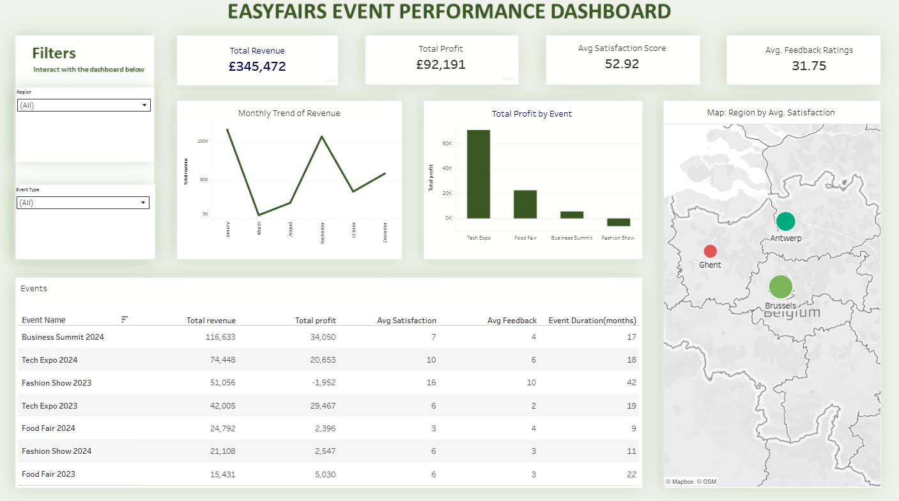

# EasyFairs Data Pipeline Project

## Project Overview

This dbt project was designed to transform raw event data from the EasyFairs event platform(demo dataset) into structured and analytics-ready datasets hosted in Google BigQuery. The goal is to build a reliable and scalable data pipeline that enables reporting and key performance metric analysis for stakeholders.

---

## Problem Statement

The EasyFairs team lacked a unified view of event performance across attendees, exhibitors, and sales. Data was fragmented across multiple sources, making it difficult to answer critical business questions such as:

- How successful are our events in terms of attendee satisfaction and sales?
- Which regions or event types generate the most profit?
- Are there correlations between exhibitor feedback and attendee satisfaction?

This project solves this by cleaning, unifying, and modeling raw data into actionable insights using dbt.

---

## Data Pipeline Architecture

The project follows a layered architecture using dbt's modular approach:

1. **Raw Layer (Sources)**  
   External datasets are sourced directly from BigQuery (raw layer defined in `sources.yml`).

2. **Staging Layer**  
   Basic cleaning and standardization of raw data: null handling, casting, renaming fields, etc.

3. **Intermediate Layer**  
   Aggregation and joining of related datasets (e.g., merging sales, attendees, and exhibitor metrics per event).

4. **Final/Reporting Layer**  
   Business-friendly models used for dashboards or reporting: clean, aggregated, and documentation-ready.

---

## Data Visualization

👉 [View Interactive Dashboard on Tableau Public](https://public.tableau.com/app/profile/babalolatosin/viz/Easyfairs/Dashboard1?publish=yes)

---

## Key Insights

Based on the final Tableau dashboard:

- Total Revenue across all events: £345,472

- Total Profit: £92,191

- Avg. Satisfaction Score: 52.92

- Avg. Feedback Rating: 31.75

# Detailed Insights
Top Performing Event

Business Summit 2024 had the highest revenue (£116,633) and profit (£34,050), indicating strong commercial performance.

Profitability Discrepancies

Despite decent revenue, Fashion Show 2023 recorded a negative profit (-£1,952), highlighting a need to revisit cost structures or pricing models.

Satisfaction vs. Profit

Tech Expo events delivered high profits and strong feedback/satisfaction, suggesting high-value engagement.

Regions like Antwerp had the highest average satisfaction scores, while Ghent underperformed, indicating regional differences in event experience quality.

Temporal Revenue Trends

Revenue fluctuated across months with peaks in January and September — critical periods for event planning.

Duration vs. Satisfaction

Events with longer durations (e.g., Fashion Show 2023 with 42 days) do not always correlate with better satisfaction or profit, indicating duration is not a direct performance driver.
---

## How to Run This Project Locally

To run this dbt project on your machine:

1. **Clone the repo:**
   git clone https://github.com/your-username/easyfairs_project.git
   cd easyfairs_project

2. **Install the dependencies**
pip install dbt-bigquery

3. **Set up your dbt profile**
Configure your ~/.dbt/profiles.yml with your BigQuery project and credentials.

4. **Test and run**
dbt debug      # Check your connection
dbt deps       # Install any packages
dbt seed       # (if applicable)
dbt run        # Build all models
dbt test       # Run tests
dbt docs generate && dbt docs serve  # Open documentation in your browser

**Contributors**

Oluwatosin Babalola: Senior Data Analyst, Project Owner
